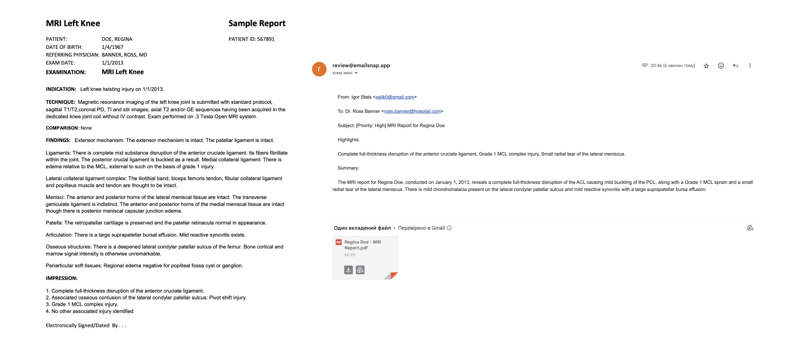

# EmailSnap Project Summary

<i>EmailSnap is an AI-powered service that simplifies email processing by analyzing email threads, attachments, and summarizing key action items. By leveraging LLMs, EmailSnap provides users with a quick and actionable summary of their emails, allowing them to focus on what matters most.</i>


<a href="https://igorsteblii.medium.com/empower-your-email-routine-with-llm-agents-10x-efficiency-unlocked-e3c81b05d99e
">Medium: Empower Your Email Routine with LLM Agents: 10X Efficiency Unlocked</a>


<div align="center">
  
</div>

## Overview 

### Key Features

* Automated Email Parsing: Handles complex email threads, removes redundant information, and formats the content into an easy-to-read structure.
* Attachment Processing: Automatically renames and summarizes attachments (PDFs, images, etc.) using AI, helping users quickly understand the content.
* Actionable Insights: Extracts action items and key highlights from the email body and attachments, making decision-making faster and easier.

### How it Works

1. Email Receival: Emails are forwarded to `review@emailsnap.app`, where the service processes both the email content and its attachments.
2.  AI-Powered Processing: Using the LangChain stack, including LangGraph and LangSmith, multiple LLM calls process different parts of the email:
    * Format the email body, handle threads, and remove irrelevant content.
    * Read and convert attachments (images, PDFs) into Base64 for analysis.
    * Summarize the attachments and rename files based on content.
3. Final Email Generation: A clean and concise email summary is generated, including key highlights, action items, and renamed attachments.

### Infrastructure

The underlying infrastructure is built using AWS services:

* SES For receiving emails.
* S3: For storing email content and attachments.
* SQS/SNS: To handle email notifications and message queueing.
* RDS (MySQL) and EC2: For running the Dockerized service and storing data
* LangChain, LangSmith for managing LLM processes and monitoring performance.

## Setup

Follow next steps to run the project:

### .env 

Create .env file with:
(for simplicty use `openssl rand -base64 42` to generate random keys)

```
MYSQL_ROOT_PASSWORD=[Random]
MYSQL_DATABASE=[Random]
MYSQL_USER=[Random]
MYSQL_PASSWORD=[Random]
RDS_DATABASE_URL=[From Terraform Output]
S3_BUCKET=[From Terraform Output]
SQS_QUEUE_URL=[From Terraform Output]
OPENAI_API_KEY=[Visit OpenAI]
AWS_REGION=us-east-1
AWS_ACCESS_KEY_ID=[Optional, in case you want to run locally]
AWS_SECRET_ACCESS_KEY=[Optional, in case you want to run locally]
SUPERSET_SECRET_KEY=[Random]
SUPERSET_ADMIN_USERNAME=[Random]
SUPERSET_ADMIN_PASSWORD=[Random]
SUPERSET_ADMIN_EMAIL=[Random]
SUPERSET_DATABASE_URL=[From Terraform Output, use differnt DB name]
LANGCHAIN_TRACING_V2=true
LANGCHAIN_ENDPOINT="https://api.smith.langchain.com"
LANGCHAIN_API_KEY=[Visit Langchain]
LANGCHAIN_PROJECT=[Any value]
```

### SSH 

Follow [./ssh/Readme.md](ssh/README.md) steps:

1. Create a new SSH key in /shh folder; 
2. It will be automatically installed by Terraform on EC2
3. Copy it to your `~/.ssh` and create configurations for `ssh emailsnap`

### AWS

Create a service role for Terraform

### DNS

Make sure you purchased domain name;

### Terraform 

Follow steps in [./terraform/Readme.md](terraform/README.md):

1. Update variable, including domain name in [variables.tf](terraform/variables.tf)
2. Apply terraform infrastructure
3. On the first attempt it will fail as AWS SSL Certificate is not verifiend, go to the console, copy CNAME and add your your DNS configurations
4. Apply terraform infrastructure again
5. Read output variable `terraform output`
5. Update `.env` and `~/.ssh/config` with correct output variable

### Database setup 

1. Connect to AWS RDS
    * Can use dbeaver.io or similar
2. Apply all migration files from [Database](Database) folder

### Clone and run project on EC2

1. Connect to the EC2 `ssh emailsnap`
2. Copy `ssh` from machine: `cat ./.ssh/id_rsa.pub` 
3. Add `ssh` key to git ptovider. Gitlab/Github
4. Clone project `git clone ...` 
5. cd `emailsnap-service`
6. run `docker-compose up`

<i>You can use `nvim` to edit files, it is installed with Terrafomr ([main.tf](terraform/main.tf)).</i>

### SES Verification 

Open `SES` dashboard:

 1. Find `Configuration -> Identity -> DKIM`, press `Generate`
    * Copy `CNAME` records to your domain DNS provider 
 3. Add MX in DNS provider: Naem: `domain`; Mail server `10 inbound-smtp.us-east-1.amazonaws.com`
 4. Open `Amazon SES -> Email receiving`, select our rule `default-rule-set` press `Activate`
 5. Open `SNS` -> `Identity`-> Open our identity -> `Authentification` -> `Custom MAIL FROM domain`: Setup and add MX to Cloudflare
 6. Open `SNS` -> `Get Production Access`, provide justification for send access.


 ## Sample

Let's take a look at a real example. I took an MRI report in PDF format from an online source, sent it to one email address, and then forwarded it to review@emailsnap.app. EmailSnap generated a new subject, highlights, and summary. It also extracted the recipient from the PDF - Dr. Ross Banner - and finally suggested a new file name: Regina Doe MRI Report, based on the patient's name and procedure.

 